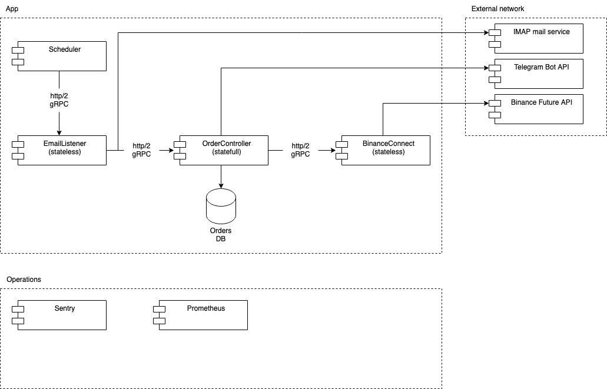

# TraderBot

Trader Bot purpose is to copy future orders from following traders from TraderWagon without TraderWagon commission.

Process:

1. Follow trader on TraderWagon with minimal commission rate
2. Get E-Mail notification from TraderWagon and TraderBot will parse and create new order with custom quantity in
   Binance

## Application schema



## Technologies and tools

* .NET 7.0
* HTTP/2 with Protocol Buffer v3
* RavenDb for order storage

## Third part dependencies

* MailKitLite, License: MIT
* Binance.Spot, License: MIT
* RavenDB.Client, License: MIT

## External services

* Email server with IMAP protocol
* Binance Future API

# Build and run

1. Create test account and API keys for Binance Future

https://www.binance.com/en/support/faq/how-to-test-my-functions-on-binance-testnet-ab78f9a1b8824cf0a106b4229c76496d

2. Set secret local credentials for Binance:

Api Key:

> cd TraderBot.BinanceConnect
> dotnet user-secrets set "Binance:ApiKey" <api-key>

Secret Key:

> cd TraderBot.BinanceConnect
> dotnet user-secrets set "Binance:SecretKey" <secret-key>

3. Configure IMAP mailbox

> cd TraderBot.EmailListener
> vi appsettings.json

```json
{
    "MailBox": {
        "MailBoxName": "Test",
        "Host": "imap.gmail.com",
        "Username": "<username>",
        "Password": "<password>",
        "GetFrom": "do-not-reply@post.traderwagon.com"
    }
}
```

Almost all modern Email services uses two-factor authentication mechanism so,
you should probably generate a custom access password for th application.

4. Configure database connection

> cd TraderBot.OrderController
> vi appsettings.json

```json
{
    "RavenDb": {
        "DatabaseName": "traderbot",
        "Urls": ["http://127.0.0.1:8080"]
    }
}
```

Set database name and endpoints

5. Run components: RavenDb, `TraderBot.EmailListener`, `TraderBot.BinanceConnect`, `TraderBot.OrderController`

Option 1. Development:

Just use your favorite IDE

Option 2. User:

> docker-compose up

# Tests

All test projects should placed to ./Tests folder

Execute

> dotnet test

# CI/CD

Section WIP.

## SBOM Task

> TraderBot % sbom-tool generate -b ./SBOM -bc . -pn TraderBot -pv 1.0.0 -ps "TraderBot LLC" -nsb urn:TraderBot

# Change Log

All changes described in [CHANGELOG.md](./CHANGELOG.md)

# Guarantee and Security

This project is not covered by the security advisory policy. Use at your own risk.

# License

License described in [LICENSE.md](./LICENSE.md)

# Documentation

